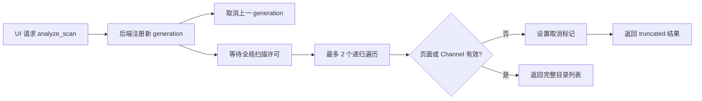

# Analyze 扫描

## 业务背景

Analyze 按目录展示磁盘占用，并允许用户逐级查看后再移到废纸篓。目录大小来自真实文件树遍历，因此必须限制并发并在页面失联后及时停止，避免开发热更新或页面重载叠加多轮扫描。

## 领域概念与核心规则

- **Analyze generation**：一次 `analyze_scan` 请求。后端同一时刻只保留最新 generation；新请求原子取消旧请求。
- **Cancellation flag**：IPC、页面生命周期和扫描线程共享的协作取消标记。取消先于任务注册时，后端保留有界 tombstone，任务注册后立即看到取消状态。
- **Global scan budget**：整个进程最多同时执行 2 个递归文件树遍历。Analyze、Clean、Apps 等功能共享该预算，不能按请求分别放大并发。
- **Partial result**：被取消的扫描标记为 `truncated`，不得写入 Analyze 缓存或用于删除计划。

## 业务流程

## 关键实现

- `src-tauri/src/state.rs` 负责任务注册、Analyze single-flight、预注册取消和 generation 收尾。
- `src-tauri/src/lib.rs` 在 `PageLoadEvent::Started`、Web 内容进程终止和主窗口销毁时取消当前 Analyze generation。
- `src-tauri/src/commands.rs` 在进度 Channel 发送失败时触发取消，并用 RAII guard 保证命令 Future 被丢弃或 join 失败时也清理 generation。
- `crates/mole-ops/src/scanutil.rs` 用进程级 RAII permit 限制递归遍历总并发；等待 permit 时每 25ms 检查一次取消标记。
