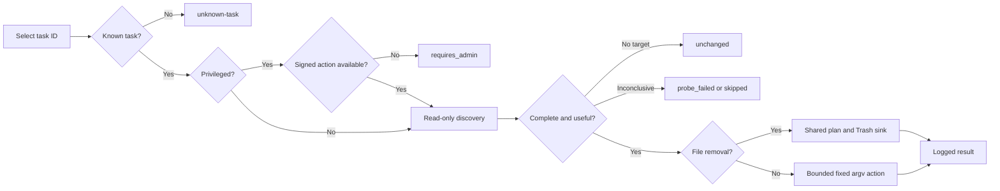

# Optimize task domain

## Background

The desktop app uses the same optimization subjects as the installed
Mole.app 1.12.1 (build 147). Bundle metadata and localized task keys were used
as the inventory source; no Mole.app interface or visual implementation is
copied. This document is the maintained contract for what the open-source
desktop surface optimizes.

## Concepts and rules

- **Catalog**: 22 stable task IDs. The list is machine-independent; missing or
  healthy targets produce `unchanged` instead of making rows appear/disappear.
- **Discovery**: read-only checks decide whether work is useful. An incomplete
  scan never feeds a deletion plan.
- **User-scope mutation**: preferences and SQLite changes use fixed argv calls.
  Candidate files always go through `engine::execute` and the shared Trash,
  validation, whitelist, identity-rebind, and logging funnel.
- **Privileged maintenance**: DNS, Spotlight rebuild, memory purge, permission
  repair, periodic scripts, and network-stack refresh require a narrow signed
  helper action. The existing helper transport supports path operations only,
  so these tasks currently return `requires_admin`; there is no `osascript`
  fallback.
- **Live guards**: Mail, Messages, Safari, and browser-sensitive font work run
  only after a tri-state process probe proves the owners are closed. Unknown
  state refuses.

## Task inventory

| Group | Stable task ID | Subject | Run condition / non-target |
| --- | --- | --- | --- |
| Launch speed | `rebuildQuickLook` | QuickLook cache | Rebuildable preview cache only |
| Launch speed | `rebuildQuickLookThumbnails` | QuickLook generators/thumbnails | No document deletion |
| Network & search | `flushDNS` | DNS cache | Signed-helper action |
| Network & search | `reindexSpotlight` | Spotlight index | Only when enabled and slow; signed-helper action |
| Maintenance | `memoryPurge` | Inactive memory | Only under elevated pressure; signed-helper action |
| Launch speed | `cleanSavedState` | Old saved window state | `.savedState` directories older than 30 days; Trash |
| Databases | `cleanQuarantineEvents` | Download quarantine history | Event rows only; file quarantine flags remain |
| Databases | `cleanCoreDuet` | Usage history DB | Only above 100 MB and conclusively closed |
| Network & search | `preventNetworkDSStore` | Finder network/USB preferences | Two reversible user defaults |
| Maintenance | `auditLegacyOverrides` | App Nap/disk-image overrides | Deletes only three named override keys |
| Launch speed | `rebuildFontCache` | User font cache | Browsers must be conclusively closed |
| Launch speed | `rebuildLaunchServices` | Open With registrations | Registration database only |
| Maintenance | `repairDiskPermissions` | Current-user home permissions | Only after an ownership/writability fault; signed-helper action |
| Maintenance | `runPeriodicMaintenance` | Daily/weekly/monthly scripts | Only when stale and available; signed-helper action |
| Databases | `vacuumSQLiteDatabases` | Mail/Messages/Safari DBs | Real SQLite, at most 100 MB, at least 5% free pages, integrity OK, owners closed |
| Databases | `repairSharedFileLists` | Finder shared file lists | Invalid `.sfl2/.sfl3`; recent-document lists excluded; Trash |
| Launch speed | `cleanBrokenLaunchAgents` | User LaunchAgents | Absolute `Program` evidence and missing executable; Apple/relative/unknown entries excluded; Trash |
| Databases | `repairBrokenPlists` | Third-party preferences | Invalid root-level plists only; Apple/global/loginwindow preferences excluded; Trash |
| Databases | `pruneNotificationDB` | Notification Center records | DB above 50 MB; delivered records older than 30 days |
| Network & search | `pruneSpotlightOrphanRules` | Spotlight preference rules | Valid third-party ID, absent from app roots and Spotlight; system/Apple/unknown entries retained |
| Launch speed | `auditLoginItems` | Login items | Read-only report; no automatic removal |
| Network & search | `flushNetworkStack` | Route and ARP caches | Only on unhealthy network without VPN/proxy; signed-helper action |

## Flow

## Verification

- `cargo test --workspace` pins the exact 22 IDs, admin refusal, tri-state
  process behavior, bounded-command timeout, and high-risk discovery rules.
- `cargo clippy --workspace --all-targets -- -D warnings` keeps direct deletion
  methods outside the sink forbidden.
- `npm run build` verifies the existing UI consumes the unchanged IPC shape.
