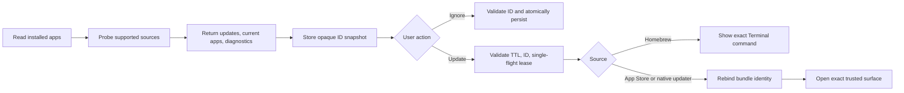

# Software update domain

## Background

The Updates segment follows the source model exposed by Mole.app 1.12.1:
Homebrew, Mac App Store, Sparkle, Electron, and website/original-updater
fallbacks. The open-source desktop app intentionally does not copy Mole.app's
private CommerceKit or direct bundle-replacement implementation. It aligns the
update subjects and user workflow while retaining a verifiable safety boundary.

## Source policy

| Source | Discovery | Action |
| --- | --- | --- |
| Homebrew cask | `brew outdated --json=v2`; exact Caskroom receipt binds an `.app` artifact | Show `brew upgrade --cask <validated-token>` for Terminal |
| Homebrew formula/package | Same machine-readable payload | Show `brew upgrade --formula <validated-token>` for Terminal |
| Mac App Store | Exact `_MASReceipt` plus Apple lookup by bundle ID | Open the exact numeric App Store product URL |
| Sparkle | HTTPS `SUFeedURL`; appcast short version | Open the installed app's own updater |
| Electron/GitHub | Signed app's `app-update.yml`; GitHub latest release API | Open the installed app's own updater |
| Electron/generic | HTTPS provider URL and `latest-mac.yml` metadata | Open the installed app's own updater |
| Website | Reserved for an exact HTTPS destination; never inferred from a display name | Open the official page; no direct replacement |

## Core rules

- Update buttons carry only opaque backend-issued IDs. App paths and URLs
  remain backend-only; a validated Homebrew token appears only inside the
  read-only Terminal command hint.
- A scan expires after 15 minutes. Update and ignore actions reject missing,
  duplicate, unknown, or expired IDs.
- Homebrew is read-only in the desktop app. Machine-readable scan tokens
  produce exact Terminal command hints; display names never become tokens and
  no package-manager mutation path exists.
- App actions re-read `CFBundleIdentifier` and current version before opening.
- All external commands have wall-clock bounds, closed stdin, stable locale,
  concurrent stdout/stderr draining, and capped retained diagnostics.
- Source failures produce diagnostic codes. An empty result with failed probes
  is not reported as “all up to date”.
- Only one delegated update action may run at a time. Cancellation kills the
  current child and marks remaining items cancelled.
- A regression test asserts Homebrew rows never reach the command runner.

## Ignore and cache behavior

Ignored IDs are stored atomically at
`~/.config/mole/ignored_updates.json` with schema version 1. They remain in the
catalog's hidden section and can be restored. A complete scan is reused for
five minutes when the tab remounts; “Recheck” bypasses that cache. Every
delegated action invalidates the update authorization snapshot and requires a
fresh scan.

Every complete scan is also persisted to
`~/.config/mole/cached_updates.json` as a display-only catalog. On the next
tab open (including after relaunch) `cached_app_updates` paints that catalog
instantly with update/ignore actions disabled and a checking indicator, while
the real scan runs in the background and swaps in live rows. The persisted
file never contains authority fields (`bundle_id`, `app_path`,
`external_url` are skip-serialized) and is never loaded into the action
snapshot, so a tampered cache can change pixels but cannot drive an action.

## Flow

## Verification

- Unit tests cover JSON contracts, version comparison, token/URL validation,
  command timeout/cancellation, ignore schema, bundle rebinding, package-manager
  non-execution, and distinct failure causes.
- `make desktop-check`, the frontend production build, and
  `cargo build -p tidy` are the acceptance gates.
