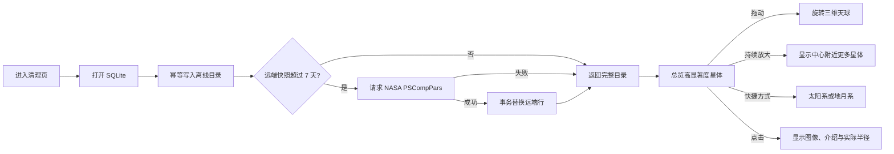

# 清理页星体探索

## 业务背景

清理页在等待扫描时有一块持续运行的星河画布。星体探索将它扩展为可选的真实天体目录，但不改变扫描、预览、确认或删除安全边界。

## 领域概念

- **星体目录**：应用私有目录中的 `celestial.sqlite3`。首次创建时写入离线太阳系数据，并按七天周期尝试同步 NASA Exoplanet Archive `PSCompPars` 的全部确认行星及其主星。
- **目录快照**：同步在单个 SQLite 事务中替换远端数据。请求失败时继续使用上次成功快照；从未同步成功时仍可探索离线目录。
- **球面坐标**：确认系外行星按主星的 RA/Dec 投影到可旋转的三维天球。相同主星的多颗行星仅添加深度缩放后才可见的确定性微偏移。
- **真实尺寸**：已知平均半径以 km 保存和展示。画布使用半径的对数比例，保持真实大小顺序，同时避免恒星与小行星的尺度差让小天体完全不可操作。
- **分级显示**：总览只显示高显著度对象；持续围绕视觉中心放大时逐级降低门槛，最终显示当前视野内所有 SQLite 行。
- **观测快捷方式**：“全部星图”恢复完整目录；“太阳系”和“地月系”同时设置观察方向、缩放级别和对象过滤。
- **介绍图像**：地球、火星和木星使用项目中已有的 NASA 纹理；其它对象按稳定目录 id 生成数据化示意，并在界面中明确标注，不能冒充实拍。

## 核心规则

1. SQLite 是天体名称、类型、位置、距离、半径、发现方式、介绍与来源的真源；UI 不保存模拟星体清单。
2. 远端同步有 6 秒连接超时和 20 秒总超时，并在阻塞工作线程运行，不能阻塞清理入口或 WebView 动画。
3. 拖动改变天球 yaw/pitch；前后半球采用透视深度和经纬网反馈。滚轮、`+` 和 `-` 始终围绕当前视觉中心缩放，范围为 `0.8x` 到 `64x`。
4. 星体本体随缩放按对数增益放大并设上限，深度缩放不能只扩大对象间距。
5. 点击只更新本地查看状态和介绍卡片，不产生网络请求，也不修改清理状态。
6. `prefers-reduced-motion: reduce` 下不启动动画循环，但旋转、缩放、点击和目录加载仍可用。
7. 目录数据库位于 Tauri app data 目录，不在清理候选根目录内。

## 业务流程

## 关键实现

- `desktop/crates/mole-ops/src/celestial.rs`：SQLite schema、太阳系种子、NASA 同步、事务替换和目录读取。
- `desktop/src-tauri/src/commands.rs`：薄 IPC 命令，解析 app data 路径并将数据库工作放入 blocking worker。
- `desktop/ui/src/explore.ts`：Rust DTO 的 TypeScript 镜像。
- `desktop/ui/src/particles.ts`：三维天球投影、透视经纬网、快捷聚焦、分级显示、视口裁剪、随缩放增长的真实半径对数比例和命中检测。
- `desktop/ui/src/views/clean.ts`：目录加载、快捷入口、来源状态、真实纹理与数据化介绍图像。

数据来源：NASA Solar System Exploration 与 NASA Exoplanet Archive `PSCompPars`。数据库保留每行的来源 URL，远端归档的具体数量会随新发现变化。
